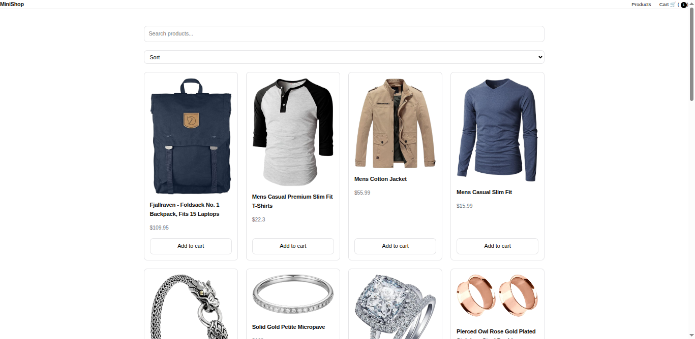
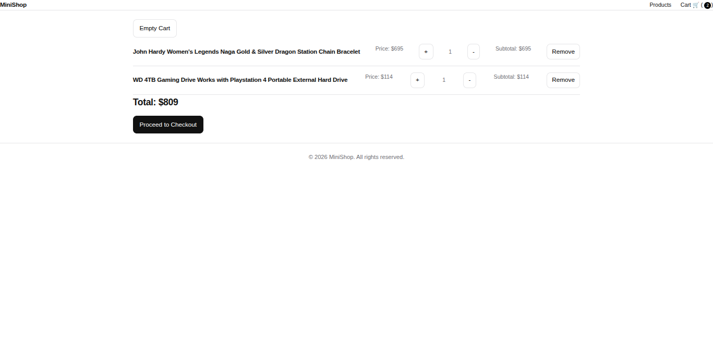

# MiniShop – **A Tiny Store With Big JavaScript Energy** 🛍️⚡

### **Overview** 🚀

MiniShop is a Single Page Application (SPA) built with pure Vanilla JavaScript.

No React.
No Vue.
No frameworks holding your hand.

Just you, the DOM, and questionable financial decisions.

With MiniShop, you can:

* Browse products from an external API
* Search like a detective
* Sort like a spreadsheet warrior
* Add things to your cart you probably don’t need
* Persist that cart in `localStorage` (because commitment matters)

---

### **How It Works** 💻

1. **Browse Products**
   Products are fetched dynamically from an API.
   If the internet works, the store works. If not… we blame WiFi.

2. **Search & Sort**
   Type into the search bar and watch products disappear dramatically.
   Sort by price — either “I’m responsible” (Low → High) or “I deserve this” (High → Low).

3. **Add to Cart**
   Click “Add to Cart” and boom — it lives forever in `localStorage`.
   Even page refreshes can’t undo your shopping impulses.

4. **Manage Cart**
   Increase quantity.
   Decrease quantity.
   Remove items.
   Watch the total climb like your monthly expenses.

---

### **Technologies Used** 🔧

* HTML5
* CSS3
* Vanilla JavaScript (ES Modules)
* Fetch API
* Browser History API
* localStorage

Basically modern web development… minus the 700MB `node_modules` folder.

---

### **Key Features** 🎉

* 🔀 Client-side routing (no page reloads — we’re fancy like that)
* 🔍 Live search (type fast, filter faster)
* 🔽 Price sorting (for budget mode vs chaos mode)
* 🛒 Add to cart functionality
* ➕➖ Quantity controls
* 🗑 Remove items (regret button included)
* 🧹 Empty cart option (emotional reset)
* 💾 Persistent cart storage
* 🔔 Toast notifications (because feedback matters)

---

### **Screenshots**




---

### **Demo Video** 🎥

[Watch the demo video here]()

---

### **Project Structure** 📂

```id="aa91fp"
e-comm/
│
├── index.html
│
├── css/
│   └── styles.css
│
└── js/
    ├── app.js
    ├── router.js
    ├── product.js
    └── cart.js
```

Clean. Modular. Respectable.

---

### **Architecture Overview** 🧠

**index.html**
The stage. The theater. The container of dreams.

**app.js**
The conductor. Starts everything. Keeps things civilized.

**router.js**
The traffic police. Controls which page appears without refreshing.

**product.js**
The shopkeeper. Fetches and displays products.

**cart.js**
The accountant. Tracks your spending habits in `localStorage`.

---

### **Data Flow Overview** 🔄

```id="flow123"
index.html
   ↓
app.js
   ↓
router.js
   ↓
product.js / cart.js
   ↓
localStorage (your digital shopping memory)
```

Simple. Predictable. Slightly addictive.

---

### **Getting Started** 🚀

Because this project uses **ES Modules** and **client-side routing**, you can’t just double-click `index.html` like it’s 2009.

You need a local server.

Don’t panic.

---

## ✅ Recommended: Run with `npx serve -s`

This is the smooth, headache-free way.

```bash id="serve001"
npx serve -s .
```

What this magical spell does:

* Starts a local static server
* `-s` enables **single-page mode**
* Redirects all routes back to `index.html`
* Prevents dramatic 404 errors when refreshing `/cart`

Why this matters:

Your app uses:

* `history.pushState()`
* Client-side routing
* JavaScript-rendered pages

Without `-s`, refreshing `/cart` makes the server look for a real `/cart` file… which doesn’t exist… and then everything cries.

After running the command, open:

```id="serve002"
http://localhost:3000
```

Refresh all you want. It won’t break.
Unlike some life decisions.

---

### **Learning Goals** 🎯

This project demonstrates:

* Modular JavaScript architecture
* SPA routing without frameworks
* State management using `localStorage`
* DOM manipulation mastery
* Clean separation of concerns

It proves one thing:

You don’t need React to build something dynamic.
You just need structure… and patience.

---

### **Final Thoughts** 🧠

MiniShop is small, but it punches above its weight.

It’s a reminder that:

* Frameworks are tools
* JavaScript is powerful
* And your cart will always remember what you added

Even if you try to forget.

Build it. Break it. Improve it. Deploy it. 🚀

---

## **License**

MIT License — because sharing is caring.

This project is licensed under the MIT License - see the [LICENSE](./LICENSE) file for details.

---

# Happy Shopping (Responsibly)! 🛍️💸

---